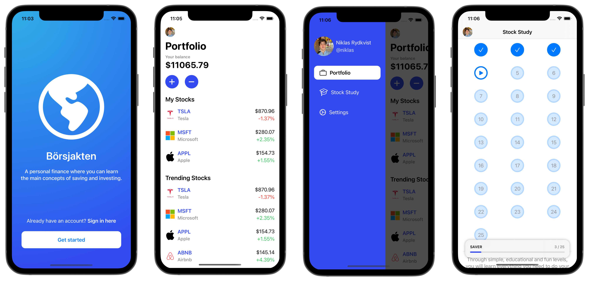

# Börsjakten

A Swedish Personal Finance mobile app where one can learn the main concepts of investing and personal finance, such as the Stock Market, Real Estate, Cryptocurrencies, Savings, and Bank Loans. Included with a Stock Market sandbox where you can buy and sells stocks with fictional money.

## Setup

Xcode and a Google Cloud settings file will be needed to get the application fully functional and connected to the application's database. Contact the author ([@Nojze](https://github.com/Nojze)) to receive the file.

## Author

Niklas Rydkvist: [niklas@rydkvist.com](mailto:niklas@rydkvist.com)

## License
Börsjakten is available under the [MIT license](https://github.com/Nojze/borsjakten/blob/main/LICENSE).